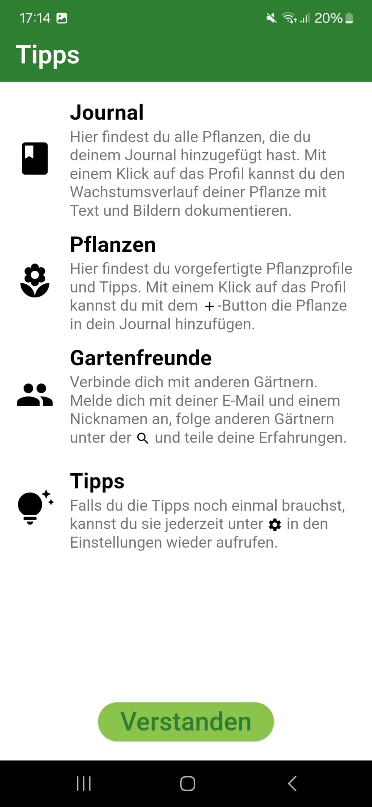
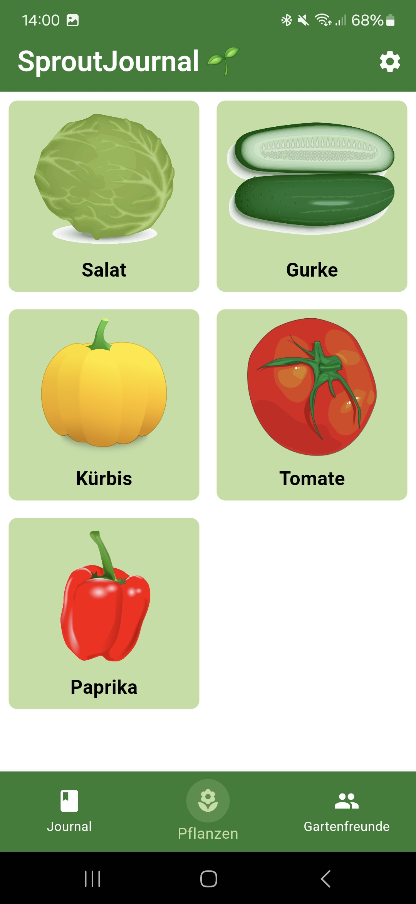
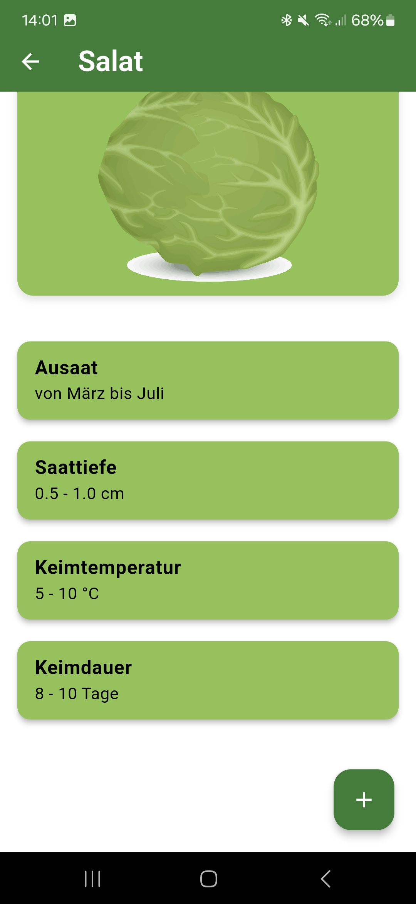
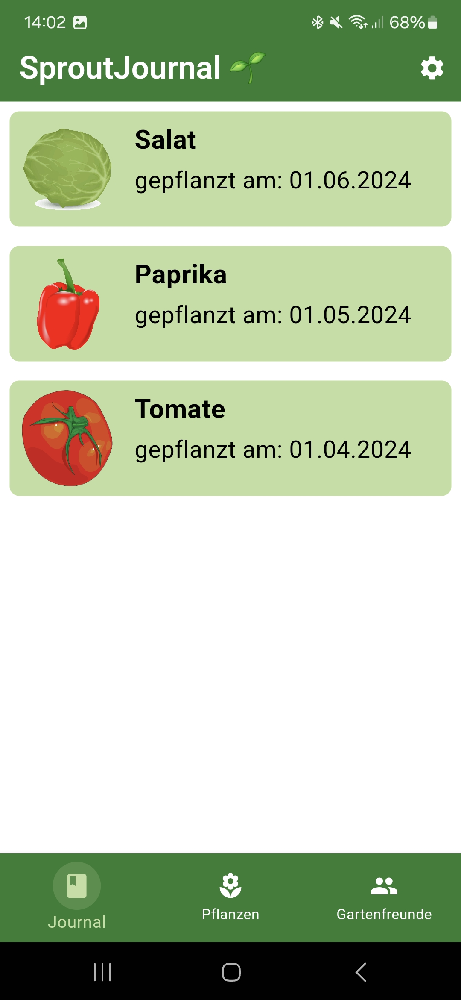
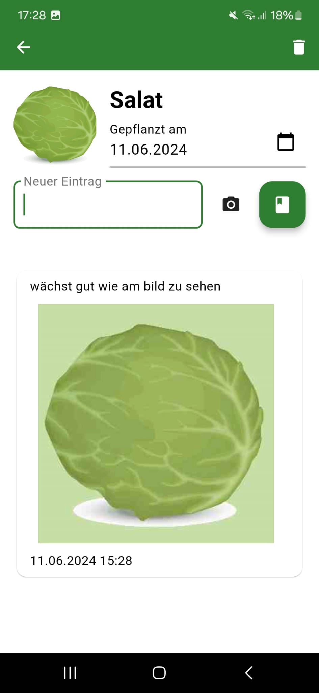
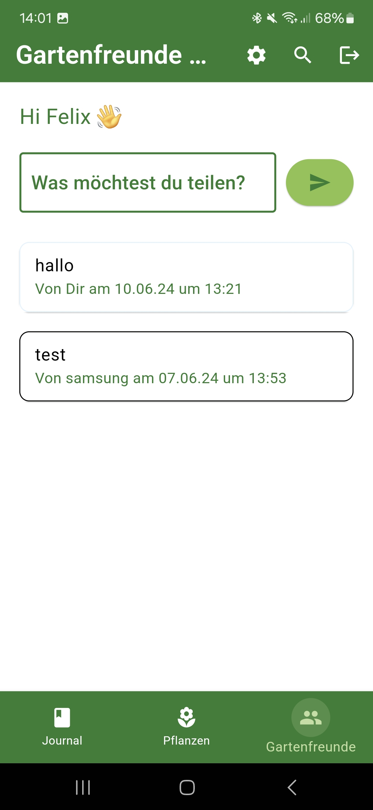
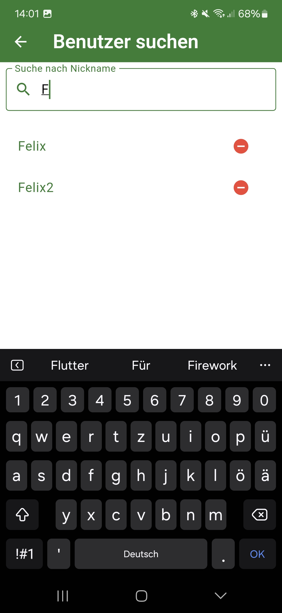

### General Information

This app was developed during the summer semester of 2024 in the course "Ausgewählte Projekte der Informatik." The goal was to develop an Android app that helps users document and archive their planting and harvesting activities, as well as connect with fellow gardening enthusiasts. The GUI of the app is in German. On the first launch, the app will ask for permission to access the device's storage. This is necessary for saving images of the plants and journal entries. The app then shows this explanation screen:

<p align="center">
  
</p>

The app is divided into sections using a _BottomBar_ layout. The functions for documenting the growth of your plants are found in the _Journal_ and _Pflanzen_ sections, where users can document the growth of their plants. In the _Pflanzen_ section, a predefined plant profile can be selected and added to the "Journal" (the inventory). These plant profiles also provide useful tips on plant care.

<p align="center">
  
  
  
  
</p>

The _Gartenfreunde_ tab covers the app's social media functionality. Here, users can register with an email address, password, and nickname. After registration, users can create posts and follow other users to see their posts.

<p align="center">
  
  
</p>

### Project Structure

The folder [snapshots](./snapshots/) contains images of the GUI development. The folder [assets](./assets/) contains the assets added to the app. In [pubspec.yaml](./pubspec.yaml) all dependencies can be found. The main code is in the folder [lib](./lib/). [android](./android/) is an auto-generated folder that is needed for Flutter to build apps for Android.

The main code is in the folder [lib](./lib/) and is explained in the following:
- **[lib](./lib)**: The main directory for the Flutter project, containing all the core application code and resources.

- **[database_services](./lib/database_services)**: Includes all the services and managers related to database operations.
  - **[firebase](./lib/database_services/firebase)**: Contains files related to Firebase services such as authentication and general Firebase functionalities. Firebase is used solely for the Gartenfreunde part.
  - **[sqllite](./lib/database_services/sqllite)**: Contains files for managing SQLite database operations, such as handling inventories and journal entries. SQLite is used for the plant profiles and the journal entries.

- **[models](./lib/models)**: Holds the data models used throughout the application. Each file typically represents a different model, such as user, plant, and post models.

- **[screens](./lib/screens)**: Contains all the UI components and pages of the application.
  - **[elements](./lib/screens/elements)**: Reusable UI elements (partly containing functionality belonging to the element). This includes elements like bottom bars, feed elements, and specific components for plant journals.
  - **[main_pages](./lib/screens/main_pages)**: The main three pages of the application that can be reached by the bottom bar directly: the garden friends page, journal feed, and library feed.
  - **[sub_pages](./lib/screens/sub_pages)**: Subpages that provide additional functionality, like the hint page, journal entry page, and plant description page.
    - **[gartenfreunde](./lib/screens/sub_pages/gartenfreunde)**: Specific subpages related to the "Gartenfreunde" feature, including login, registration, user search, and welcome pages.

- **[services](./lib/services)**: Contains service files that provide functionalities such as notifications for posts.

- **[utils](./lib/utils)**: Utility files for logging.

### Build

To build your own app, you need a Google Account. [Enable Firebase](https://firebase.google.com/docs/flutter/setup) for the Google Account and insert your own credentials in a _.env_ file in the root directory.

Run `flutter build apk --split-per-abi` to build the app. The app will be built for the following architectures:

1. **app-arm64-v8a-release.apk**:
   - Architecture: ARM 64-bit
   - ABI: arm64-v8a
   - Details: This APK is optimized for 64-bit ARM processors, which are common in modern smartphones and tablets. This is the recommended APK for most devices.

2. **app-armeabi-v7a-release.apk**: 
   - Architecture: ARM 32-bit
   - ABI: armeabi-v7a
   - Details: This APK is optimized for 32-bit ARM processors, which are found in older and some lower-end Android devices. 

3. **app-x86_64-release.apk**:
   - Architecture: x86 64-bit
   - ABI: x86_64
   - Details: This APK is optimized for 64-bit x86 processors, which are commonly used in certain tablets, Android emulators, and some niche devices. 

The files can be found in the folder `build/app/outputs/flutter-apk/`.

### Issues

Besides standard issues in the development process, the following problems were encountered:

- **Image loading**: The images in the app are saved to and loaded from the device storage. This causes the app to feel unsmooth when opening a Journal Page. Having many images in a Journal Page can sometimes cause the app to freeze for up to a second. Numerous attempts were made to solve this problem, which could be improved but not completely resolved. First, image caching was recommended but did not work in this special case. As a consequence, image compression to 25% was tested and implemented since this seemed to improve loading times significantly. Images are compressed before saving them to storage. Lastly, many minor improvements were made to the code to improve the loading times. This included intelligent loading of the feed. As long as the page is open, the feed will not reload but will be kept in RAM as a list. Even deleting elements from the feed will not lead to a reload of the feed. This is only done when a new page is opened.
- **Combination of SQLite and Firebase**: The app uses both SQLite and Firebase. This was an architectural decision to enable the users to use the journal feature without having to register to a remote database. For the social media part, a local database would not be sufficient because users have to be able to access other users' data. This combination caused the problem of double implementation of a data storage system, resulting in a more complex code structure and increased development time.
- **Build warnings**: When running `flutter build apk --split-per-abi`, two build warnings pop up. The build still succeeds and the app works fine.
  - ```Note: Some input files use or override a deprecated API. Note: Recompile with -Xlint:deprecation for details.```: This seems to be a known Flutter issue (see [here](https://github.com/flutter/flutter/issues/106537#issuecomment-1165558491))
  - ```The binary version of its metadata is 1.9.0, expected version is 1.6.0.```: This seems to be a known issue due to version mismatches between the Kotlin version used to compile certain dependencies and the version expected by the project. The project uses a lot of different dependecies. What is recommended on the internet is to change the Kotlin version in the Gradle file. This was tested with different Kotlin versions but the warning still persists. The app still works fine and the build succeeds. Therefore, this warning is not considered critical.


### External Sources

- Biological plant information for the profiles from internet research, but mainly from personal experience.
- The app logo was designed using DALL-E.
- The plant drawings for the plant profiles are from:
  - [Tomato](https://commons.wikimedia.org/wiki/Category:SMART-Servier_Medical_Art_-_Food)
  - [Cucumber](https://commons.wikimedia.org/wiki/File:Cucumber.png)
  - [Pumpkin](https://commons.wikimedia.org/wiki/File:Pumpkinn.svg)
  - [Lettuce](https://commons.wikimedia.org/wiki/File:Iceberg_lettuce.svg)
  - [Pepper](https://commons.wikimedia.org/wiki/Category:SMART-Servier_Medical_Art_-_Food)
