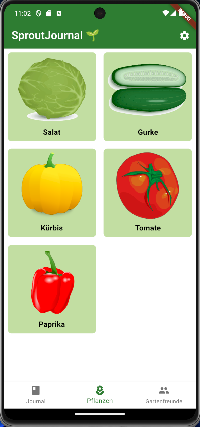
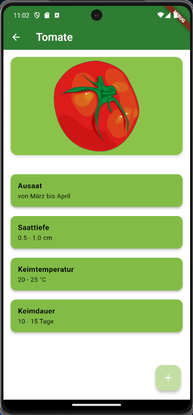
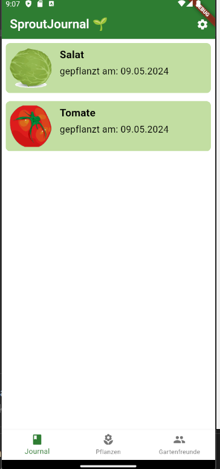
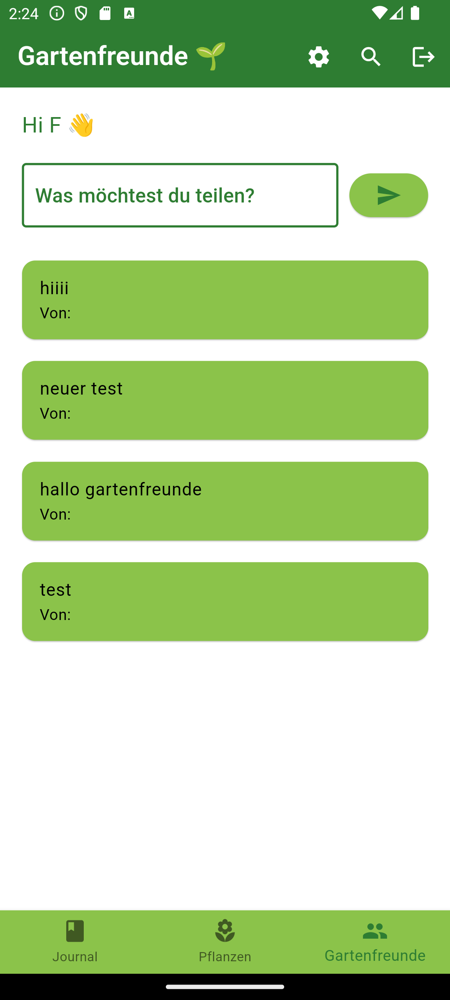
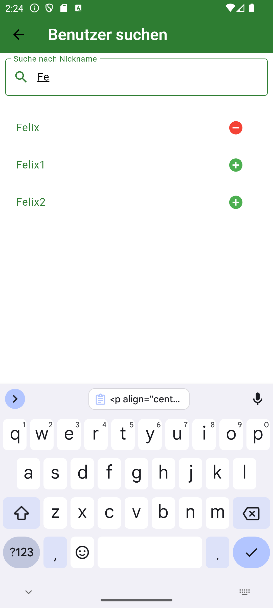
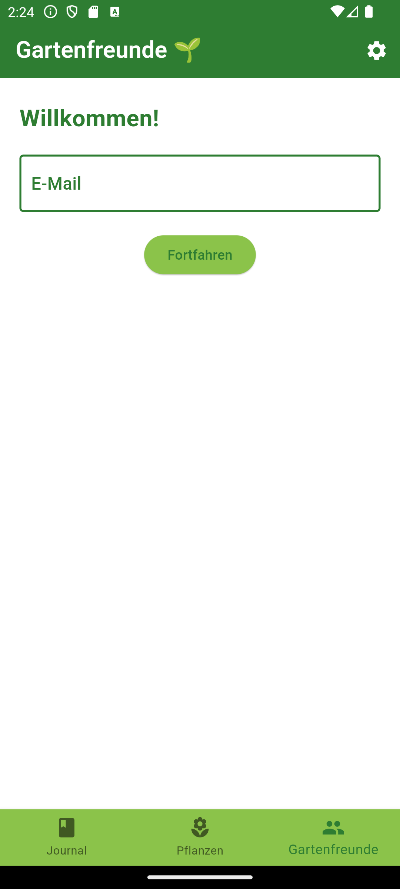

### General Information

This app was developed during the summer semester of 2024 in the course "Ausgewählte Projekte der Informatik." The goal was to develop an Android app that helps users document and archive their own planting and harvesting activities, as well as connect with fellow gardening enthusiasts. The GUI of the app is in German.

The app is divided into sections using a _BottomBar_ layout. The functions for documenting the growth of your plants are found in the _Journal_ and _Pflanzen_ sections, where users can document the growth of their plants. In the _Pflanzen_ section, a predefined plant profile can be selected and added to the "Journal" (the inventory). These plant profiles also provide useful tips on plant care.

  
  
  

The _Gartenfreunde_ tab covers the app's social media functionality. Here, users can register with an email address, password, and nickname. After registration, users can create posts and follow other users to see their posts.

  
  
  

### Project Structure

The folder [snapshots](./snapshots/) contains images of the gui development. The folder [assets](./assets/) contains the assets added to the app. In [pubspec.yaml](./pubspec.yaml) all dependencies can be found. The main code is in the folder [lib](./lib/). [android](./android/) is an auto generated folder that is needed for flutter to build apps for android.  

### Sources

- Plant information for the profiles from internet research, but mainly from own experience
- The app logo was designed using Dall-E
- The plant drawings for the plant profiles are from:
    - [Tomato](https://commons.wikimedia.org/wiki/Category:SMART-Servier_Medical_Art_-_Food)
    - [Cucumber](https://commons.wikimedia.org/wiki/File:Cucumber.png)
    - [Pumpkin](https://commons.wikimedia.org/wiki/File:Pumpkinn.svg)
    - [Lettuce](https://commons.wikimedia.org/wiki/File:Iceberg_lettuce.svg)
    - [Pepper](https://commons.wikimedia.org/wiki/Category:SMART-Servier_Medical_Art_-_Food)

### Firebase

To build your own app you need a Google Account. [Enable Firebase](https://firebase.google.com/docs/flutter/setup) for the Google Account and insert your own Credentials in a _.env_ file in the root directory.

### Build

run `flutter build apk --split-per-abi` to build the app. The app will be built for the following architectures:

#### 1. app-arm64-v8a-release.apk:

Architecture: ARM 64-bit
ABI: arm64-v8a
Details: This APK is optimized for 64-bit ARM processors, which are common in modern smartphones and tablets. This is the recommended APK for most devices.

#### 2. app-armeabi-v7a-release.apk: 

Architecture: ARM 32-bit
ABI: armeabi-v7a
Details: This APK is optimized for 32-bit ARM processors, which are found in older and some lower-end Android devices. 

#### 3. app-x86_64-release.apk:

Architecture: x86 64-bit
ABI: x86_64
Details: This APK is optimized for 64-bit x86 processors, which are commonly used in certain tablets, Android emulators, and some niche devices. 

The files can be found in the folder `build/app/outputs/flutter-apk/`.
